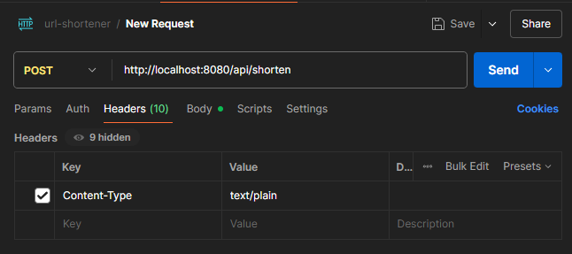
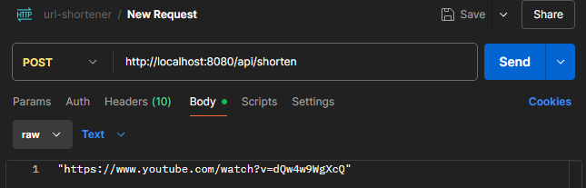
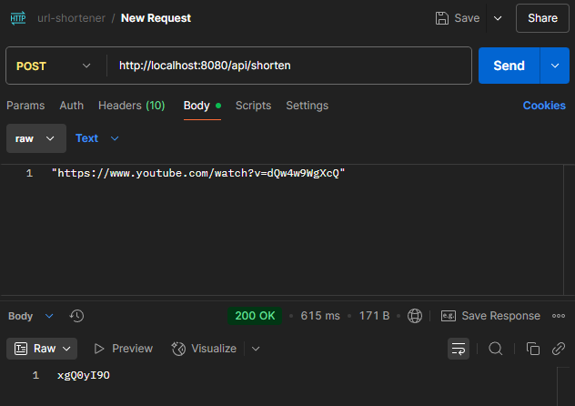
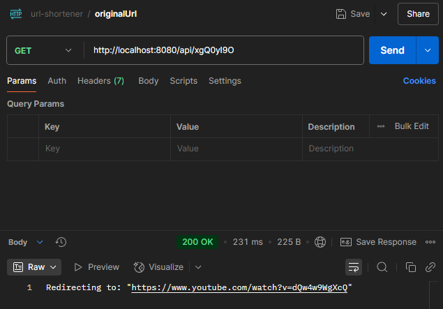
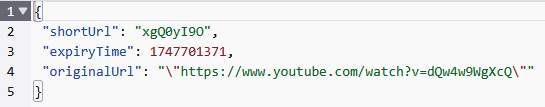

# URL Shortener
This project aims to implement a URL Shortener using Spring Boot and DynamoDB for implementation.

## WIP Documentation

---
## Table of Contents
1) [Prerequisites](#prerequisites)
   - [AWS IAM & CLI](#1-aws-iam--cli)
   - [DynamoDB](#2-dynamodb)
   - [Spring Boot](#3-spring-boot)

2) [AWS Deployment](#aws-deployment)

3) Jenkins

4) [Technical Design](#technical-design)
   - [controller.ShortenerController.java](#1-controllershortenercontrollerjava-)
   - [service.UrlShortenerService.java](#2-serviceurlshortenerservicejava)
   - [service.impl.UrlShortenerServiceImpl.java](#3-serviceimplurlshortenerserviceimpljava)
   - [model.UrlMapping.java](#4-modelurlmappingjava)
   - [repository.UrlMappingRepository.java](#5-repositoryurlmappingrepositoryjava)
   - [repository.impl.UrlMappingRepositoryImpl.java](#6-repositoryimplurlmappingrepositoryimpljava)
   - [config.DynamoDBConfig.java](#7-configdynamodbconfigjava)


5) [Testing the application](#testing-the-application)

---

## Prerequisites:

### 1. AWS IAM & CLI
The AWS setup for this project needs a couple of components to function properly. For brevity, I'm assuming that you already have an AWS account that is a Root user. <br>
1. Create a new user with the following permissions:
   - DynamoDBFullAccess

    *We will add more permissions as we go.*
    <br><br>To create the user:
   1. Go to the IAM console and click on `Users` in the left sidebar.
   2. In the top right corner, click on `Create User`.
   3. Enter a username and leave `Provide user access to the AWS Management Console - optional` unchecked. Then click `Next`
   4. Select a group if you already have one, or else:
      1. Click on `Create group`.
      2. Enter a meaningful group name.
      3. In Permission Policies, search for 'Dynamo', which should return a couple of policies. Select `AmazonDynamoDBFullAccess`, which is typically the first one.
      4. Click `Create group`.
   5. Click `Next` and review the options you have chosen, and add Tags if you wish to do so. Then click on `Create user`.
   6. Once the user has been created, click the on user to see more details, and go to the `Security Credentials` tab.
   7. Scroll down to find the `Access keys` section, and click on `Create access key`.
   8. Select `Command Line Interface (CLI)`. AWS will show a warning about using alternatives, suggesting to use AWS CloudShell or AWS CLI V2. Since we are creating a simple user and don't want to deal with SSO right now, we will click on the Confirmation check box, and click on `Next`.
   9. Enter a tag value to keep track of what this user is for (preferably something to do with this project), and click on `Create access key`.
   10. You will be shown the `Access key ID` and `Secret access key`. Copy these values and store them in a safe place. You will not be able to see the secret access key again, so make sure to copy it somewhere safe. You can also download the credentials as a CSV file.
   11. Click on `Close` to finish creating the access key.
<br><br>
2. Download and install the AWS CLI from [here](https://docs.aws.amazon.com/cli/latest/userguide/cli-chap-getting-started.html)
3. Once you have the AWS CLI installed, check by running `aws --version` in your terminal.
4. Configure the AWS CLI by running `aws configure` in your terminal. You will be prompted to enter the following values:
   - **AWS Access Key ID**: Enter the access key ID you copied earlier.
   - **AWS Secret Access Key**: Enter the secret access key you copied earlier.
   - **Default region name**: Enter the region you want to use (e.g., `us-east-1`).
   - **Default output format**: Enter `json` (Leaving this blank will default it to json).

### 2. DynamoDB
1. Go to the DynamoDB console and click on `Create table` on the right side of the screen.
2. Enter a table name (e.g., `url-shortener`)
3. For 'Partition Key', enter the name `shortUrl` with type `String`.
4. Leave the table settings as 'Default'.
5. Add a tag with a meaningful Key and Value (e.g. Key = "Project", Value ="url-shortener") to keep track of your resources.
6. Click on `Create table` to create the table.
7. Once the table is created, click on 'Explore Items', make sure the correct table is selected, and then click on `Create item`.
8. In the `Attributes` section, enter the following values:
   - Attribute Name = **shortUrl**; Value = Enter a random string (e.g., `abc123`).
   - Click on 'Add new attribute' of type 'Number' and enter Attribute Name = **expiryTime**; Value = Enter the current date and time in epoch format (Get epoch from [here](https://www.epochconverter.com/) e.g., `1747531132`).
   - Click on 'Add new attribute' of type 'String' and enter Attribute Name = **originalUrl**; Value = Enter a long URL (e.g., `https://www.google.com`).
   - Click on 'Create item' to create the item.
9. Once the item has been created, you will see it in this 'Explore Items' section.

*Steps 10-12 are not necessary, but more of a 'good to have', since TTL will help keep our table size nice and small. You don't need to enable it right away, and this can be done at a later time too.*

10. Go back to the `Tables` section and click on the table you just created.
11. Scroll down to find 'Time to Live (TTL)', and click on 'Turn on'.
12. Enter **expiryTime** as the TTL attribute name and click on 'Turn on TTL'.

### 3. Spring Boot
I am assuming that you have Java and an IDE of your choice installed. I prefer IntelliJ IDEA, but you can use any IDE you like. <br>
1. Go to [Spring Initializr](https://start.spring.io/) and create a new Spring Boot project with the following dependencies:
   - Spring Web
   - Spring Cloud Function
   - Lombok
   *We need the below dependencies too, but they are not available in start.spring.io. We will add them manually later.*
   - AWS SDK DynamoDB
   
2. Choose the latest available stable version of Spring Boot (e.g., `3.2.5`).
3. Set the project metadata:
   - Group: `com.urlshortener`
   - Artifact: `shortener`
   - Name: `shortener`
   - Package name: `com.urlshortener.shortener`
   - Packaging: `Jar`
   - Java version: `21` (or the version you are using)
4. Click on `Generate` to download the project as a zip file.
5. Unzip the downloaded file and open it in your IDE.
6. Open the `pom.xml` file and add the following dependencies:
```
<dependency>
    <groupId>software.amazon.awssdk</groupId>
    <artifactId>dynamodb</artifactId>
    <version>2.20.0</version>
</dependency>
```
---

## AWS Deployment

---

## Jenkins
To automate the CI/CD pipeline for this project, I use a local, dockerized installation of Jenkins. Docker is very handy here, because it allows us to run Jenkins without having to install it locally.
1. Install Docker on your machine if you haven't already.
2. Open a terminal and run the following command to pull the Jenkins image:
   ```
   docker pull jenkins/jenkins
   ```
   This fetches the latest LTS (Long Term Support) version of Jenkins.
3. Run the Jenkins container with the following command:
   ```
   docker run -d -p 8080:8080 -p 50000:50000 --name jenkins jenkins/jenkins
   ```
   This command runs Jenkins in detached mode (`-d`), maps port `8080` of the container to port `8080` on your host machine, and maps port `50000` for JNLP agents.
4. Once the container is running, open your web browser and go to `http://localhost:8080`.
5. You will be prompted to unlock Jenkins. To do this, you need to retrieve the initial admin password. Run the following command in your terminal:
   ```
   docker exec jenkins cat /var/jenkins_home/secrets/initialAdminPassword
   ```
   Copy the password displayed in the terminal.
6. Paste the password into the Jenkins unlock page and click `Continue`.
7. You will be prompted to install plugins. You can choose to install the suggested plugins or select specific ones. For this project, you can install the suggested plugins, along with the following additional plugins:
   - Git plugin
   - S3


---

## Technical Design

The project is split into packages based on functions to keep the code clean and organized. The main packages are:
- `controller`: Contains the REST controller for handling incoming requests.
- `service`: Contains the service layer for business logic.
- `repository`: Contains the repository layer for interacting with DynamoDB.
- `model`: Contains the model classes for the application.
- `config`: Contains the configuration classes for AWS SDK and DynamoDB.

The main class `ShortenerApplication` is the entry point for the Spring Boot application.

### 1. controller.ShortenerController.java: 

This class contains the REST endpoints for the application, handling incoming requests and returns responses to the client. 

It contains the following endpoints:
- `POST /shorten`: Shortens a given URL and returns the shortened URL.
- `GET /{shortUrl}`: Redirects to the original URL for the given shortened URL.

Since we are using Spring Boot, we simply need to create methods with the required annotations to handle the requests.

- `createShortURL`: handles our POST request, and is annotated with `@PostMapping("/shorten")`

  - The logic for this is fairly simple - The method takes a URL as input from the user, and calls `createShortUrl` from `UrlShortenerService` to return a shortened URL. 
- `getOriginalURL`: handles our GET request, and is annotated with `@GetMapping("/{shortUrl}")`

   - Given a shortUrl from the user, this method calls `getOriginalUrl` from `UrlShortenerService` to return the original URL.

### 2. service.UrlShortenerService.java
This is an interface that defines the methods we use above for shortening and retrieving URLs.
The methods defined here are implemented by the `UrlShortenerServiceImpl` class.

### 3. service.impl.UrlShortenerServiceImpl.java
This class implements the `UrlShortenerService` interface and contains the business logic for shortening and retrieving URLs.
It contains the following methods:
- `createShortUrl`: This method takes the URL input from the user and returns a shortUrl. There are 2 cases that we need to address here: first if we have a new URL that we haven't seen before, and the second if we already have that URL in our database.

   We start by generating a `shortUrl` using the method `generateShortUrl()`. It then checks in our database if there is an entry with this `shortUrl`. 
  - If an entry is found, it checks if the `expiryTime` of the entry has passed the current time. 
    - If it has, the database entry is updated with a new `expiryTime` as `now + 3600 seconds` (1 hr). 
    - If it hasn't, it skips to the return statement.
  
    Finally, it returns the `shortUrl`. 
  - If an entry is not found in the database, it creates a new entry in the database with the `shortUrl` and `originalUrl`, and sets the `expiryTime` as `now + 3600 seconds` (1 hr). It then returns the `shortUrl`.

- `generateShortUrl()`: This method is used to generate a `shortUrl` from a given `originalUrl`.
    We first create a MessageDigest object using the SHA-256 algorithm, and then we convert our `originalUrl` into a byte array using UTF_8 encoding. This is passed to our `digest` method, which returns a byte array.
    This byte array is converted into a Base64 string that is URL-safe, and removes any padding characters in the Base64 output.
    Finally, we take the first 8 characters of the Base64 string and return it as our `shortUrl`.

- `getOriginalUrl`: This method takes a `shortUrl` as input and returns the `originalUrl`. It first checks if the `shortUrl` exists in our DynamoDB table.

### 4. model.UrlMapping.java

This class is used to create the URL mapping object that mirrors our database. It contains the following fields:
- `shortUrl`: The shortened URL.
- `originalUrl`: The original URL.
- `expiryTime`: The expiry time of the shortened URL in epoch format.
We use lombok annotations to generate getters, setters, and constructors for this class. 

### 5. repository.UrlMappingRepository.java

This class is the interface that we use to interact with our DynamoDB table. It contains the following methods:
- `save`: Saves a new item to the DynamoDB table.
- `findByShortUrl`: Finds a database item based on its shortened URL.

### 6. repository.impl.UrlMappingRepositoryImpl.java

This class contains the business logic to perform the database reads/writes, and implements `UrlMappingRepository`. 
We define an object of `DynamoDBClient` from the AWS SDK to interact with our DynamoDB table.
This class contains the following methods:

- `save`: This method takes a `UrlMapping` object as input and saves it to the DynamoDB table. It creates a new HashMap called `item` to store our data elements, and we enter our `shortUrl`, `originalUrl` and `expiryTime` into this map using AttributeValue and the corresponding `fromS() or fromN()` method based on the datatype. We then create a `PutItemRequest` object with the table name and the item to be saved, and call the `putItem` method of the `DynamoDBClient` object to save the item to the table.
- `findByShortUrl`: This method takes a `shortUrl` as input and returns the corresponding `UrlMapping` object from the DynamoDB table. It creates a new HashMap called `key` to store the key of the item to be retrieved, and enters the `shortUrl` into this map using AttributeValue.fromS(). We then create a `GetItemRequest` object with the table name and the key to be retrieved, and call the `getItem` method of the `DynamoDBClient` object to retrieve the item from the table. This returned value is stored in a map, which we use to create a `UrlMapping` object to return. 

### 7. config.DynamoDBConfig.java

The last class for now, which is used to initialize the AWS SDK and DynamoDB client. We set up the parameters for accessing our DynamoDB table, inputting our region and credentials method which at this moment is using environment variables to pass our Access Key and Secret Access Key.

### 8. StreamLambdaHandler.java

This class is boilerplate code used to create a Spring Cloud Function handler for the application. It implements the `RequestHandler` interface and overrides the `handleRequest` method to handle incoming requests. The `handleRequest` method takes an `AwsProxyRequest` as input and returns an `AwsProxyResponse` as output. It uses the `ShortenerController` class to handle the request and return the response.

---

## Testing the application

1. Run the application using your preferred method. I use IntelliJ, so I set up my environment variables in the Run/Debug Configurations.
2. Once the application is running, you can test the endpoints using Postman or any other API testing tool. I use Postman, so the below steps will use that as an example.
3. Open Postman and create a new request.
4. Set the request type to `POST` and enter the URL `http://localhost:8080/api/shorten`.
5. In Headers, enter `Content-Type` as the key and `text/plain` as the value.



6. Now move to the `Body` tab, where you set the type to `raw` and `Text` as the format. In the text box below, enter a URL that you want to shorten.



8. Click on `Send` to send the request. You should see a response with the shortened URL.



9. To test the `GET` request, create a new request in Postman of the type `GET`.
10. Enter the URL `http://localhost:8080/api/{shortUrl}` where `{shortUrl}` is the shortened URL you received in the previous step.



11. You can also check the DynamoDB console to see if the item has been created in the table. Go to the `Explore Items` section of your table and you should see the item with the `shortUrl`, `originalUrl`, and `expiryTime` attributes.

